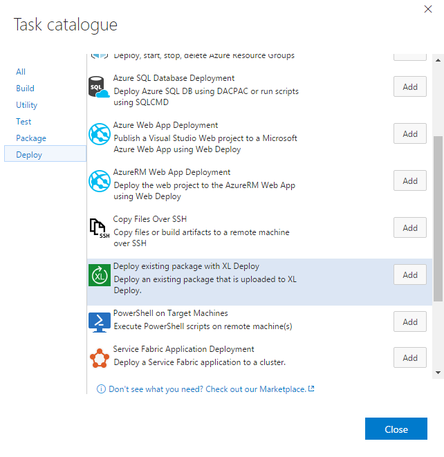

[XL Deploy](https://xebialabs.com/products/xl-deploy/) provides enterprise-scale application release automation for any environment. It lets you automate and standardize complex deployments, speeding up deployment time while greatly reducing errors and failed deployments.

XL Deploy gives you visibility into the deployment status of your applications and environments, and even enables you to support self-service deployment while maintaining governance and control.

With this extension, you will be able to deploy existing artificats from XL Deploy.

### Setup
The [VSTS Task library](https://github.com/Microsoft/vsts-task-lib) needs to be included before this extension can be packaged/used. How to install the VSTS Task library is described [here](https://github.com/Microsoft/vsts-task-lib/blob/master/powershell/Docs/Consuming.md).

## Usage

This extension installs a build task that will help you to package and deploy your application through a VSTS/TFS build pipeline and XL Deploy.

## Create an endpoint for XL Deploy

To create an endpoint for XL Deploy:

1. In the project control panel, go to the **Services** tab.

    

1. Click **New Service Endpoint** and choose **XLDeploy Endpoint**.

    

1. In the **Connection Name** box, enter a meaningful connection name such as *XL Deploy Server*.
1. In the **Server URL** box, enter a URL such as *http://my.xldeploy.server:4516/*. Ensure that the URL includes the correct port number.
1. In the **User name** and **Password/Token Key** boxes, enter the user name and password that should be used to authenticate with XL Deploy.
1. Click **OK**.

Now you can refer to this endpoint from an XL Deploy release task.

## Deploy with XL Deploy

The XL Deploy release task is available in the **Deploy** category. In your release definition, add a new task and search for the **XL Deploy** task.

The task has the following options:

### Action

Action to be perfomed by the release task.
 - *Deploy application created from build*: If the application the must be deployed is created from a build definition and has the same version number as the build. **Please ensure that this build is added as a *linked artifict* to this release definition.**
 - *Deploy application not created from build*: If the application the must be deployed is in XL Deploy but has no relation with a build definition.

### XL Deploy endpoint

An endpoint is a pointer to an XL Deploy instance. Select the instance that you want to use from the **XL Deploy Endpoint** list.

If this is the first task you are configuring, you must add a new endpoint. If you have other build definitions that use XL Deploy tasks, you can select an endpoint that is already defined.

### Builddefinition

*This parameter is only available when the action is: Deploy application created from build.*
Enter the name of the builddefinition that created the XL Deploy package during the build of the application. 

### Application version
*This parameter is only available when the action is: Deploy application not created from build*.
Enter or choose the version number of the application the must be deployed.

### Application location

Enter the location of the application from the repository in XL Deploy, without the *Applications* root. For example: *Orders/Order Web Project*.

### Target environment

Enter or choose the target environment where the application needs to be deployed, with the *Environments* root. For example: *Environments/Development/DevelopmentMachine01*

## Advanced options

The **Advanced options** selection allows you to override the default values of certain parameters.

### Rollback on deployment failure

If you want XL Deploy to roll back the deployment if it fails, select **Rollback on deployment failure**.

## Additional information

Additional information about XL Deploy is available on the [documentation site](https://docs.xebialabs.com/xl-deploy/).
